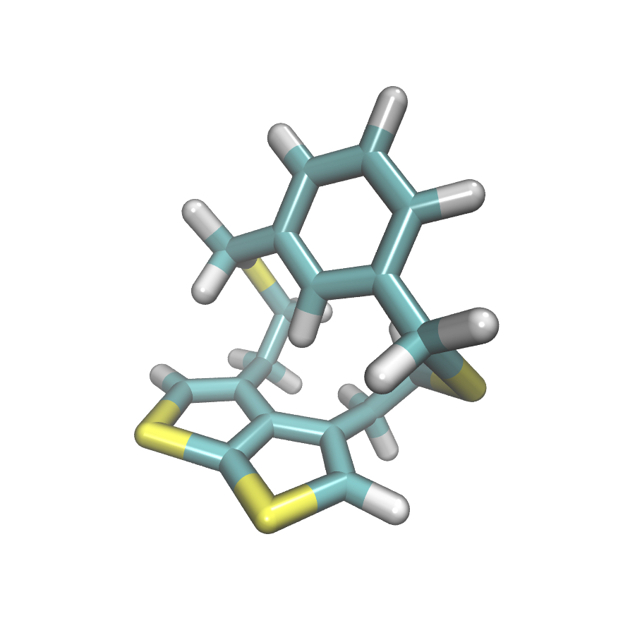

NEW MORESIM 2.0
===============
**Modular Replica Exchange Simulator
VERSION 2.0**

Table of Contents
-----------------
.. contents:: 
	:depth: 1
	:local:
	:backlinks: none
	
About NEW MORESIM 2.0
---------------------
MORESIM is a made home package that allows to perform standard MD simulations
at a low level of theory (baselined) and correct the obtained PES using some 
ML potentials !
	--> The different MD approaches:
		* Conventional Molecular Dynamics (cMD)
		* Hamiltonian Reservoir Replica Exchanges Molecular Dynamics (hRES)
	--> The different available integrators:
		* Monte Carlo
		* Velocity Verlet Langevin Modified
		* Velocity Verlet
	--> The different available baselined and ML corrections:
		* XTB, DFTB
		* KRR, N2P2, DeepMD

Requirements
------------
Mandatory:
	* Python 3.9 (should also work with 3.6/3.7/3.8 but not tested)
	* Python basic packages:
		- os
		- sys
		- numpy 1.20.3
		- argparse 1.1
		- psutil 5.8.0
		- time 
		- cpuinfo
		- scipy 1.6.3 (deprecated, is useless)
		- dill 0.3.4
		- concurrent
	* Miniconda 3
	* Atomic Simulation Enviroment (ASE) version 3.22.0

Optional (depends on your target):
	* For baselined:
		* DFTB: https://dftbplus.org/download			
			- NOTE: DFTB should be compiled with python and DFTD3 options in preference
		* XTB: https://xtb-docs.readthedocs.io/en/latest/setup.html
	* For ML corrections:
		* KRR: qml python package https://github.com/qmlcode/qml/blob/master/README.md
		* N2P2: pynnp python package https://github.com/CompPhysVienna/n2p2
		* DeepMD: deepmd python package https://github.com/deepmodeling/deepmd-kit
		
Standard installation 
---------------------
The best way to install the package is to create our own python environment. 
For this you can use the miniconda approach by typing in your terminal:

.. code:: bash

	~$ conda create --name mymoresim python=3.9 os sys numpy=1.20.3 argparse=1.1 psutil=5.8.0 time cpuinfo scipy=1.6.3 dill=0.3.4 concurrent ase=3.22.0

You can then activate your 
new environment:

.. code:: bash

	~$ conda activate mymoresim

And decide to deactivate it 
once finished:

.. code:: bash

	~$ conda deactivate mymoresim
	
Concerning now the different baselined and ML corrections, you should install them independently, depending on
what type fo simulations you would like to perform:
	* DFTB: ensure that the dftb+ executable is in your bin
	* XTB: ensure that the xtb executable is in your bin
	* qml: install the qml package within your python environment
	* pynnp: compile N2P2 with the pynnp module, and export your library in your PATH
	* deepmd: install it using conda, or compile deepmd with shared libraries and export it in your PATH

You can then download the MORESIM 2.0 code directly in your directory
using the followning command:

.. code:: bash

	~$ git clone https://github.com/lcmd-epfl/MORESIM.gitExample 

The directory where the code was downloaded is thus ready to be used 
for some simulations !

Finally, in order to properly use each baselined and ML correction, you should add
the path to the shared libraries as follow:

.. code:: bash

	~$ export PATH:PATH:/path/to/your/lib

and the same for python libraries:

.. code:: bash

	~$ export PYTHONPATH=$PYTHONPATH:/path/to/your/python/lib

.. note::

	These exports are not mandatory for the installation, but is good to be placed within the bashrc !

Specific installation in case of DeepMD
---------------------------------------
If DeepMD is the ML you would like target, you have to know that DeepMD-kit
allow you to directly install it using conda. Therefore, you can create your
own conda environment directly with deepmd:

.. code:: bash

	~$ conda create -n deepmd deepmd-kit=*=*cpu libdeepmd=*=*cpu lammps-dp -c https://conda.deepmodeling.org
	
and then add manually each python packages using the pip install command.

Possibility for GPUs plateform is also allowed:

.. code:: bash

	~$ conda create -n deepmd deepmd-kit=*=*gpu libdeepmd=*=*gpu lammps-dp cudatoolkit=11.3 horovod -c https://conda.deepmodeling.org

A fast and small tutorial for hurry users
-----------------------------------------

We list here the most important things that a user has to know
in order to correctly use the code.

A simulation is launched using directly the python plateform.
To have a spreader overview on the different possibilities on how to submit a computation, 
you can refer to the next session. You can just enter in your terminal:

.. code:: bash

	~$ python main.py --help

In our case, we will launch a simple NVT cMD simulation on a small molecule, 
the dithiaclyclophene. In the examples directory, you can find a folder named
DFTB-N2P2, you copy the whole files in your main directory. 

Therefore, the first setup is the following:
	- Type of simulation: **cMD**
	- Integrator: **VV**

The files you copied from examples/DFTB-N2P2 where trained on energies and forces of 5000 structures extracted from a converged REMD simulation using the Farthest Point Sampling (FPS) algorithm. Energies and forces for each structure correspond to the difference between the DFT energy (computed with terachem software at the PBE0/6-31G level of theory) and DFTB energy (computed at the SK level of theory with dftb+). 
Therefore, it enforces us to choose DFTB and N2P2 in our parametrization:
	- Baselined: **DFTB**
	- ML correction: **N2P2**

.. note::

	Choosing DFTB induces that the user has to enter manually the DFTB command into the main.py file ! 
	More comments on this will be available in future tutorials !

Choosing Velocity Verlet (VV) induced thus to choose a sepcific timestep:
	- Timestep: **0.5** (unit fs)
	
Finally, the rest of the setup is also specified but is not crucial for the consitency of the simulation:
	- Temperature: **300** (in K)
	- Thermostat: Nose-Hoover (by default)
	- Trajectory printing frequency: **10**
	- Number of steps: **1000**
	- Periodicity: **False**

You place the different files in a same directory:
	- N2P2 files (input.nn, scaling.data, weights.001.data, weights.006.data, weights.016.data)
	- main.py
	- lib folder
	- system.xyz
	- type.dat
Having in the same directory all the listed files, you can just submit the computation by typing in the terminal:

.. code:: bash

	~$ python main.py -p False -dyn cMD -int VV -bsnld DFTB -ml N2P2 -T 300 -ts 0.5 -freq 10 -nstp 1000 
	
The statement of your dynamics will appear in a control file labeled as **control_file.dat** and will help you
at managing the good advancement for your dynamics. Your trajectory will be printed in a file labeled as **trajectory_structures.xyz**
every stride steps. Finally, the restart file if you want to relaunch your dynamics appears as **restart.dat** and corresponds
to the last structure into trajectory_structures.xyz.

The Similar approach is used to launch a hRES simulation, we just need to add few supplementary keywords into the python
command which correspond to:
	- Number of replicas: **4**
	- Number of exchanges: **50**
	- Path of the reservoir: **examples/DFTB-N2P2-Reservoir/**
	- Size of the reservoir: **33899**
	
.. note::	
	
	Nothe that the only difference with cMD occurs for the number of steps. In the hRES case, the number of step corresponds to the amount of steps you make between each exchanges.
	
The hRES simulation is launched using this command:

.. code:: bash

	~$ python main.py -p False -dyn cMD -int VV -bsnld DFTB -ml N2P2 -T 300 -ts 0.5 -freq 20 -nstp 20 -rep 4 -rsv examples/DFTB-N2P2-Reservoir/ -szrsv 33899 -exc 50
	
Still one control file appears, and one trajectory file for each replicas is then generated. Also, one restart file for each replicas is also generated. 

This was a short brief on how to fastly use the code. For more details, we strongly recommand the more detailed tutorials
for users who would like to understand more the code.
	
More diverse Examples
---------------------
Future good tutorials are in current statement !

Besides to the short tutorial we list here some examples of possible other commands. 
Note that it is not the whole possible commands but just use here to show how a computation is basically launched.

**cMD simulations**

- DFTB/DeepMD // Monte Carlo: 

.. code:: bash

	~$ python main.py -p True -dyn cMD -int MC -rep 1 -nstp 2000 -T 300 -freq 1

- DFTB/DeepMD // Restart // Monte Carlo: 
		
.. code:: bash

	~$ python main.py -p True -dyn cMD -int MC -rep 1 -nstp 2000 -T 300 -freq 1 -rst True

- DFTB/KRR // Monte Carlo: 

.. code:: bash

	~$ python main.py -p True -dyn cMD -int MC -ml LKR -rep 1 -nstp 5 -T 300 -freq 1

- DFTB/DeepMD // Velocity Verlet Langevin Modified: 

.. code:: bash

	~$ python main.py -p True -dyn cMD -int VVL -rep 1 -T 300 -freq 1 -nstp 100 -lgv 0.01

- DFTB/DeepMD // Velocity Verlet:

.. code:: bash

	~$ python main.py -p True -dyn cMD -int VV -rep 1 -ts 1 -T 300 -freq 100 -nstp 100 -rseed 1897

- DFTB/N2P2 // Velocity Verlet:

.. code:: bash

	~$ python main.py -p True -dyn cMD -int VV -ml N2P2 -rep 1 -T 300 -freq 1 -nstp 100 

- XTB/N2P2 // Velocity Verlet: 

.. code:: bash

	~$ python main.py -p True -dyn cMD -int VV -bsnld XTB -rep 1 -T 300 -freq 1 -nstp 1000

**hRES simulations**

- DFTB/DeepMD // Monte Carlo:

.. code:: bash

	~$ python main.py -p True -dyn hRES -int MC -T 300 -freq 1 -rep 4 -rsv /home/celerse/ASE-lammps/pool_dithiacyclophene/new_reservoir/ -exc 20

- DFTB/DeepMD // Restart // Monte Carlo:

.. code:: bash

	~$ python main.py -p True -dyn hRES -int MC -T 300 -freq 1 -rep 4 -rsv /home/celerse/ASE-lammps/pool_dithiacyclophene/new_reservoir/ -exc 20 -rst True

- XTB/N2P2 // Monte Carlo:

.. code:: bash

	~$ python main.py -p True -dyn hRES -int MC -bslnd XTB -ml N2P2 -T 300 -freq 3 -nstp 3 -rep 4 -rsv /home/celerse/ASE-lammps/pool_dithiacyclophene/new_reservoir/ -exc 50

- XTB/N2P2 // Velocity Verlet:	

.. code:: bash

	~$ python main.py -p True -dyn hRES -int VV -bslnd XTB -ml N2P2 -T 300 -freq 20 -nstp 20 -rep 4 -rsv /home/celerse/ASE-lammps/pool_dithiacyclophene/new_reservoir/ -exc 50

Authors
-------
	* Raimon Fabregat: raimon.fabregat@epfl.ch
	* Frederic Celerse: frederic.celerse@epfl.ch
	* Alberto Fabrizio: alberto.fabrizio@epfl.ch
	* Veronika Juraskova: veronika.juraskova@epfl.ch
	* Benjamin Meyer: benjamin.meyer@epfl.ch
	* Theo Jaffrelot Inizant: theo.jaffrelot-inizant@sorbonne-universite.fr
	* Daniel Hollas: daniel.hollas@epfl.ch
	* Clemence Corminboeuf: clemence.corminboeuf@epfl.ch
	
